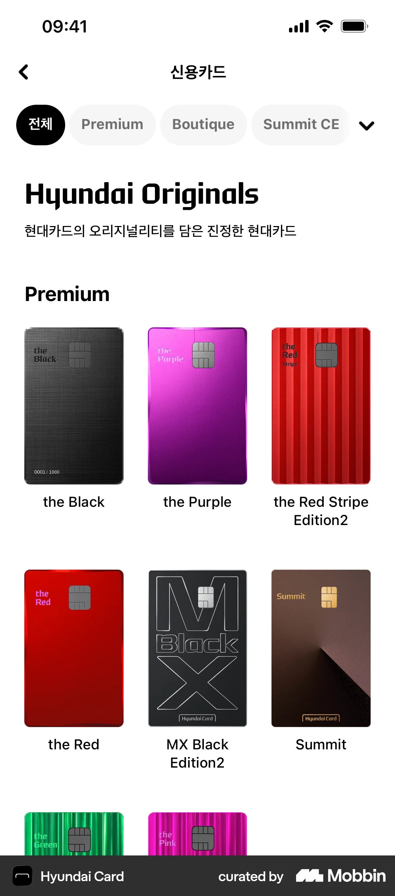

# 🛠️ Bare Flutter UI

**A "Bare Metal" implementation of Flutter layouts.**

This project bypasses the standard Flutter Widget library (`Container`, `Row`, `Column`, `Wrap`,`Center`,`Padding`,`SizedBox`,`Text`) to implement a custom rendering layer from the ground up.

## 🚀 What is this?

This project lives in the **Render Layer**.
It features custom implementations of:

- `RenderProxyBox` for Padding and Sizing.
- `RenderBox` with custom layout algorithms for Rows and Columns.
- `ContainerBoxParentData` for custom Wrapping logic.

## 🧠 Why?

I was bored and wanted to do something Flutter related and it had to be something deeper than the usual stuff.

---

Oh yeah and to better understand Flutter's layout engine by rebuilding it.

## Here is the UI I built

